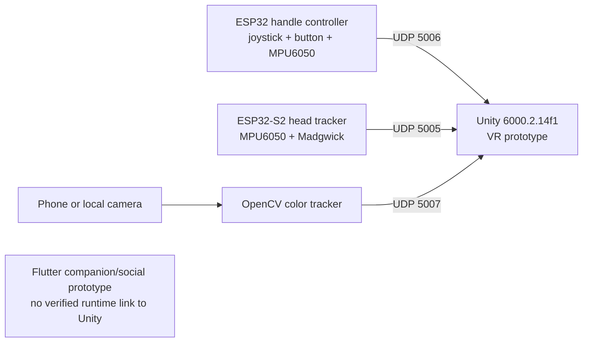

# NAO VR

NAO VR is a Unity virtual-reality prototype that receives motion and input data from custom ESP32 hardware and optional Python vision tools over UDP.

## Project Status

This repository is an experimental hardware and software prototype, not a production release. The code and packet formats are present, but controller, tracker, camera, firewall, Wi-Fi, and headset behavior must be verified with the physical hardware on the target network.

No project screenshots or recorded demo are currently committed.

## Architecture



## Components

| Component | Path | Responsibility |
| --- | --- | --- |
| Unity application | `unity/nao vr/` | Main VR project, scene, gameplay, URP assets, Input System integration, and UDP receivers. |
| Handle controller | `controller/` | PlatformIO firmware for an ESP32, joystick, button, and MPU6050 motion data. |
| Head tracker | `head_tracking/` | PlatformIO firmware for a Feather ESP32-S2 with MPU6050 input and Madgwick orientation filtering. |
| Camera tracking | `stick_tracking.py` | OpenCV color tracking that emits normalized coordinates to Unity. |
| Vision experiments | `hand_geastures.py`, `volume_hand _control.py` | MediaPipe hand-gesture and hand-distance experiments. |
| UDP diagnostics | `test.py`, `test2.py` | Console listeners for head-tracker and controller packets. |
| Flutter prototype | `nao_vr/` | Separate companion/social application prototype. |
| Documentation | `docs/` | Setup, upload, and UDP protocol notes. |

## UDP Protocol

| Signal | Sender | Unity receiver | Port | Payload |
| --- | --- | --- | --- | --- |
| Head rotation | `head_tracking` ESP32-S2 | `IMU_HeadTracking.cs` | `5005` | `pitch,roll,yaw` |
| Handle movement and input | `controller` ESP32 | `JoystickController.cs` | `5006` | `pitch,roll,yaw,stickX,stickY,button` |
| Camera position | `stick_tracking.py` | `FreeHandController.cs` | `5007` | normalized `x,y,z` |

The complete packet notes are in [`docs/UDP_PROTOCOL.md`](docs/UDP_PROTOCOL.md).

## Hardware Prerequisites

The checked-in firmware expects the following equipment:

- One ESP32 development board for the handle
- One analog joystick module with a push button
- One MPU6050 for the handle
- One Adafruit Feather ESP32-S2 for head tracking
- One MPU6050 for the head tracker
- USB cables or suitable power sources
- A Windows PC capable of running the Unity project
- A shared Wi-Fi network
- Optional phone/IP camera or local webcam for `stick_tracking.py`
- VR hardware compatible with the Unity scene and packages

## Software Prerequisites

- Unity `6000.2.14f1`
- PlatformIO
- Python 3 with the packages in `requirements.txt`
- Flutter SDK for the companion prototype
- Git LFS for the repository's binary assets

## Configuration

1. Copy `controller/include/secrets.example.h` to `controller/include/secrets.h`.
2. Copy `head_tracking/include/secrets.example.h` to `head_tracking/include/secrets.h`.
3. Set the Wi-Fi credentials and Unity PC IP in both local `secrets.h` files.
4. Copy `tracking_config.example.py` to `tracking_config.py` and configure the camera source when using Python tracking.

The local secret and tracking files are intentionally ignored. Do not commit network credentials or private camera URLs.

## Running the Prototype

Install the Python dependencies:

```bash
python -m pip install -r requirements.txt
```

Build the firmware:

```bash
pio run -d controller
pio run -d head_tracking
```

Open `unity/nao vr/` in Unity, load `Assets/Scenes/SampleScene.unity`, and start the scene. Run only the helper needed for the current input path:

```bash
python stick_tracking.py
python test.py
python test2.py
```

The PC and ESP32 devices must be on the same network, and the Windows firewall must allow UDP traffic on ports `5005`, `5006`, and `5007`.

## Validation

Useful static or build checks include:

```bash
pio run -d controller
pio run -d head_tracking
flutter analyze nao_vr
```

These commands do not replace testing with the physical controller, head tracker, camera, and VR hardware.

## Repository Notes

- Generated Unity, PlatformIO, Flutter, and IDE output is ignored.
- Large binary assets are tracked through Git LFS.
- Unity text assets are configured for more reviewable diffs.
- The Flutter application is present in the same repository, but a runtime data path between it and Unity was not found.

## Known Limitations

- Hardware-dependent paths cannot be validated without the boards, sensors, network, and VR equipment.
- UDP has no authentication or encryption in the checked-in prototype.
- Camera tracking depends on lighting, camera placement, and color calibration.
- No automated end-to-end test covers the complete hardware-to-Unity path.

## Third-Party Assets

Review [`THIRD_PARTY_NOTICES.md`](THIRD_PARTY_NOTICES.md) before redistributing the Unity project. Third-party assets retain their original terms and are not relicensed by this repository.

## License

The repository uses the custom terms in [`LICENSE`](LICENSE), which reserve all rights unless permission is granted. Third-party asset licenses remain separate.

## Contact

[Ahmed Noaman](https://github.com/noaman03) | [LinkedIn](https://www.linkedin.com/in/ahmed-noaman-07ab162b4)
